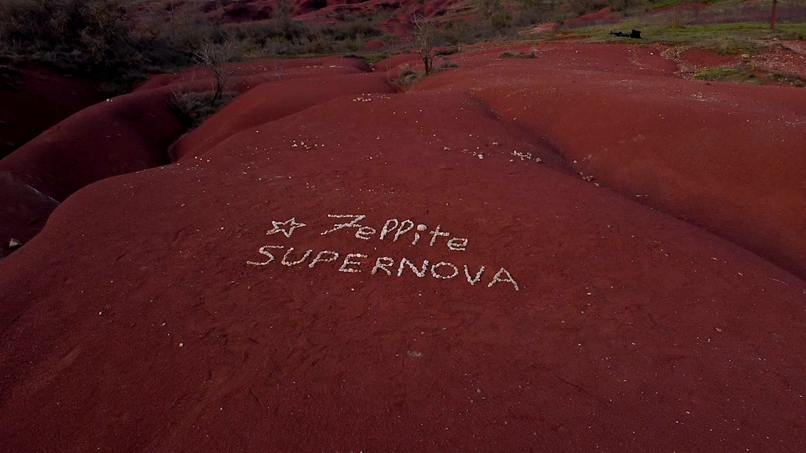

# Portfolio Noah Sorli — Mode d'emploi

## Structure des fichiers

```
portfolio-noah/
├── index.html       ← page principale
├── style.css        ← tout le design
├── script.js        ← interactions
├── CV_Noah_Sorli.pdf  ← ton CV (à copier ici)
└── img/
    ├── supernova.jpg         ← photo BTS ou screenshot Supernova
    ├── derniere-lettre.jpg   ← photo BTS ou screenshot La Dernière Lettre
    └── justdance.jpg         ← photo BTS ou screenshot Just Dance IRL
```

## Ajouter une image de projet

1. Copie ton image dans le dossier `img/`
2. Renomme-la (ex: `supernova.jpg`)
3. Dans `index.html`, remplace le `src` de l'image correspondante :
   ```html
   
   ```

Si tu n'as pas encore d'image, le site affiche automatiquement un placeholder.

## Mettre à jour les liens vidéo

Dans `index.html`, trouve chaque carte projet et remplace :
```html
data-link="https://vimeo.com/TON_LIEN_SUPERNOVA"
```
par ton vrai lien Vimeo (ou YouTube) :
```html
data-link="https://vimeo.com/123456789"
```

## Ajouter un nouveau projet

Dans `index.html`, dans la section `<div class="projects-list">`,
copie-colle ce bloc et adapte-le :

```html
<article class="project-card reveal" data-align="left" data-link="https://vimeo.com/TON_LIEN">
  <div class="project-visual">
    
    <div class="project-overlay">
      <div class="overlay-inner">
        <p class="overlay-role">Ton rôle · Autre rôle</p>
        <h3 class="overlay-title">Nom du projet</h3>
        <p class="overlay-meta">Type · Date</p>
        <p class="overlay-desc">
          Description détaillée de ton rôle et du projet.
        </p>
        <div class="overlay-tags">
          <span>Tag 1</span><span>Tag 2</span>
        </div>
        <span class="overlay-cta">Voir la vidéo ↗</span>
      </div>
    </div>
  </div>
</article>
```

- `data-align="left"` → overlay à gauche
- `data-align="right"` → overlay à droite
- Alterne gauche/droite pour le rythme visuel

## Héberger le site

Options gratuites recommandées :
- **GitHub Pages** : gratuit, fiable, lien en `ton-pseudo.github.io`
- **Netlify** : drag & drop du dossier, en ligne en 30 secondes
- **Vercel** : idem Netlify

Pour Netlify : va sur netlify.com → "Deploy manually" → glisse le dossier `portfolio-noah`.
